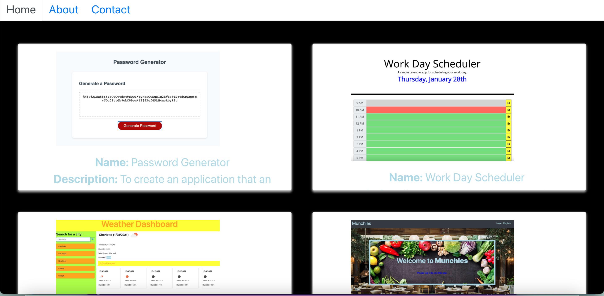

# ReactPortfolio

    
## Description

   
---
You'll be updating your portfolio and other materials to build toward being employer competitive.
    
## Table of Contents 
     
---
* [Installation](#Installation)
* [UserStory](#UserStory)
* [Usage](#Usage)
* [Credits](#Credits)
* [License](#License)
* [Badges](#Badges)
* [Questions](#Questions|Comments|Concerns)
    
---
## Installation

npm react , npm react-dom, npm react-router-dom, npm bootstrap

---

## UserStory

Creating a portfolio using React will help set you apart from other developers whose portfolios do not use some of the latest technologies.

---

## Usage 

Creating a portfolio using React will help set you apart from other developers whose portfolios do not use some of the latest technologies.

---

## Credits 

N/A

---

## License

---

## Badges 

---

## Questions|Comments|Concerns

https://github.com/imanid-code

imanidillahunt@gmail.com
---
